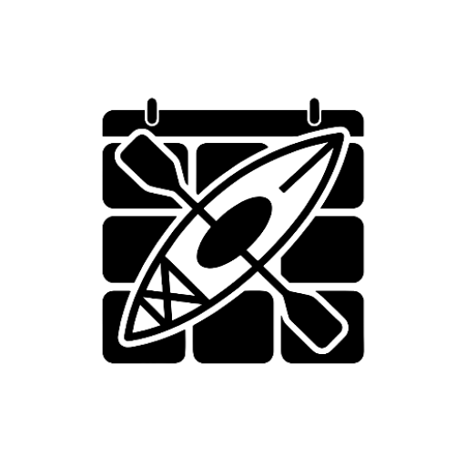
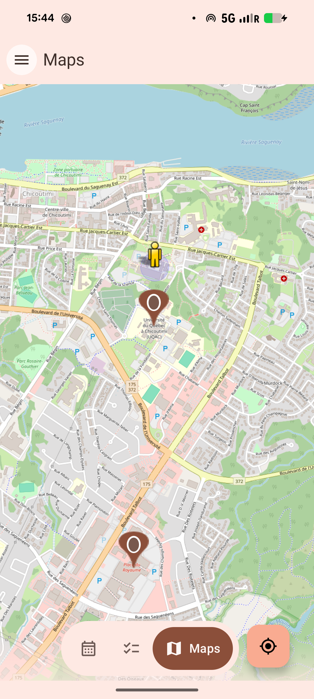

<p align="center">

</p>

# Yakak

Yakak is an all-in-one Android productivity application designed to streamline your daily routine. It integrates task management, a calendar, utility tools, and mapping features into a unified experience built with Jetpack Compose.

## Features

- **Task Management:** Create, edit, and organize personal task lists.
- **Integrated Calendar:** View deadlines and events in a centralized calendar view.
- **Reminders:** Notification system for time-sensitive tasks.
- **Maps:** Integrated map viewing within the application.
- **Settings and Customization:** Fine-grained control over application permissions and user preferences.
- **Material Design 3:** Modern interface with support for dark mode and dynamic colors.

## Technical Stack

- **Language:** Kotlin
- **UI Framework:** Jetpack Compose
- **Architecture:** MVVM (Model-View-ViewModel)
- **Database:** Room (Local persistence)
- **Navigation:** Compose Navigation (featuring Drawer and Bottom Bar)
- **Build System:** Gradle (Kotlin DSL)

## Preview

| Task List | Calendar | Maps |
| :---: | :---: | :---: |
|  |  |  |

## Installation

1. Clone the repository:
   ```bash
   git clone https://github.com/neutracity/yakak.git
   ```
2. Open the project in **Android Studio** (Ladybug or later version recommended).
3. Allow Gradle to sync and download the necessary dependencies.
4. Run the application on an emulator or a physical Android device.

## Project Structure

```text
com.kayak.yakak/
├── data/          # Room Database, DAOs, and Repositories
├── ui/            # Composables, ViewModels, and Theme definitions
│   ├── tasklist/  # Task management logic and views
│   ├── calendar/  # Calendar view implementation
│   └── maps/      # Google Maps integration
└── utils/         # BroadcastReceivers and Schedulers for reminders
```

## Contribution

Contributions are welcome. Please follow these steps:
1. Fork the project.
2. Create a feature branch (`git checkout -b feature/AmazingFeature`).
3. Commit your changes (`git commit -m 'Add some AmazingFeature'`).
4. Push to the branch (`git push origin feature/AmazingFeature`).
5. Open a Pull Request.

---
Developed by Neutra and TFB
